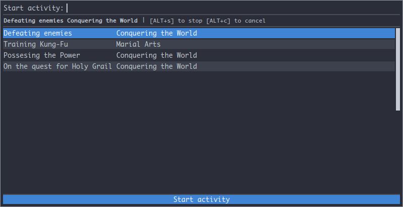

# rofi-bartib
Use [bartib](https://github.com/nikolassv/bartib) time tracker with [rofi](https://github.com/davatorium/rofi).

## Usage

```shell
rofi-bartib.sh show /path/to/activities.bartib
```

## Screenshot



Select entry to start/switch/continue.
Press <kbd>ALT+S</kbd> to stop current activity or <kbd>ALT+C</kbd> to cancel it.

## Dependencies

- rofi
- bartib
- sed
- awk
- bash
- (optional) [sxhkd](https://github.com/baskerville/sxhkd) or other hotkey manager

### Example sxhkd entry

```plain
super + b
    /path/to/rofi-bartib.sh show /path/to/activities.bartib

```
